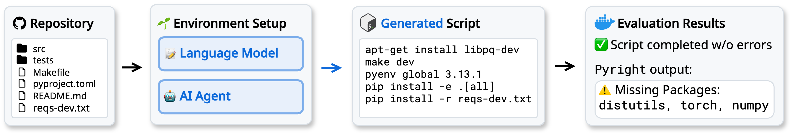

# 🌱⚙️  Environment Setup

Automating development environment setup

<p align="center">
  
</p>

## Overview

This project automates the process of setting up development environments by analyzing project requirements and configuring the necessary tools and dependencies. It supports both Python and JVM-based projects.

## Prerequisites

- [Poetry](https://python-poetry.org/) for Python dependency management
- [Docker](https://www.docker.com/) for running isolated environments

## Project Structure

```
env-setup/
├── data_collection/    # Repository analysis and data gathering tools
├── env_setup_utils/    # Core utilities for inference and evaluation
├── evaluation/         # Test suites for Python and JVM environments
└── inference/          # Environment setup agents and Docker environments
```

## Installation


Install dependencies for each component:
```bash
poetry install -C evaluation
poetry install -C inference
poetry install -C env_setup_utils
poetry install -C data_collection
```

## Usage

### Running the Full Pipeline

To run the complete pipeline (inference and evaluation):

```bash
cd env_setup_utils && poetry run python scripts/full_pipeline.py
```

Results are automatically uploaded to the `trajectories` repository on HuggingFace.

### Running Specific Agents

Use Hydra to configure and run specific agents:

```bash
cd env_setup_utils

# Run JVM environment setup
poetry run python scripts/full_pipeline.py -cn jvm

# Run Python environment setup
poetry run python scripts/full_pipeline.py -cn python
```

For all configuration options, see [conf/defaults.yaml](env_setup_utils/scripts/conf/defaults.yaml).

<!-- TODO: @owner - Please add:
1. Example output/results section
2. Link to the HuggingFace trajectories repository
3. Contribution guidelines if this is open source
4. License information -->

## Documentation

For detailed documentation on each component:

- [Data Collection](data_collection/README.md)
- [Environment Setup Utils](env_setup_utils/README.md)
- [Evaluation](evaluation/README.md)
- [Inference](inference/README.md)
